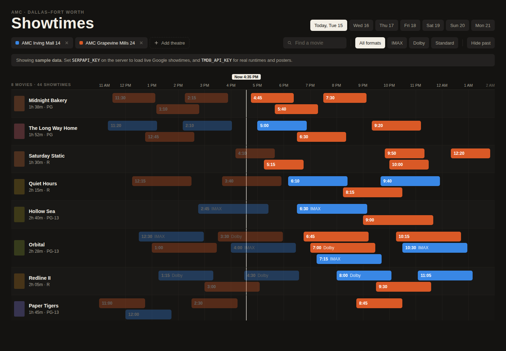

# AMC Showtimes Timeline

A visual front-end for AMC showtimes. Pick the theatres you care about and a date; the app draws
one row per movie and one bar per showtime on a shared time axis. Bar length is the runtime, bar
color is the theatre, so you can see the whole evening at a glance instead of reading lists.



## Run it

```bash
npm install
cp .env.example .env   # optional: add keys for live data
npm run dev            # web on http://localhost:5173, API on :8787
```

Without keys the server serves a built-in sample day so the UI is fully usable.

### Live data

| Variable       | What it enables                                                                                                                                      |
| -------------- | ---------------------------------------------------------------------------------------------------------------------------------------------------- |
| `SERPAPI_KEY`  | Live showtimes from Google's showtime panel via [SerpApi](https://serpapi.com/showtimes-results). One search per theatre per day, cached 15 minutes. |
| `TMDB_API_KEY` | Runtimes and posters from [The Movie Database](https://developer.themoviedb.org). Without it bars assume 2h and are drawn with a faded end.          |
| `THEATRE_TZ`   | Time zone the theatres live in (default `America/Chicago`).                                                                                          |

Set them in `.env` (loaded by `tsx` in dev) or as environment variables in production.

### Production

```bash
npm run build
npm start              # serves dist/ and /api on $PORT (default 8787)
```

## How it works

- `src/domain/` — pure, tested logic: time parsing, lane packing for overlapping showtimes, axis
  scale, row grouping and filters. Shared by the client and the server.
- `server/` — a small [Hono](https://hono.dev) app. `GET /api/theatres` lists known theatres,
  `GET /api/showtimes?theatres=a,b&date=YYYY-MM-DD` returns a merged day. Showtime sources sit
  behind `ShowtimeProvider` (`providers/fixture.ts`, `providers/serpapi.ts`); runtimes behind
  `RuntimeResolver` (`providers/tmdb.ts`). Adding AMC's own API later is one more provider.
- `src/components/` — the timeline UI. View state (theatres, date, formats, hide-past, search)
  lives in the URL so any view is bookmarkable.

Theatres not in `server/theatres.ts` can still be added by name from the UI; the name is used as
the search phrase.

## Scripts

`npm run check` runs lint, typecheck, tests and the Prettier check, which is what CI runs.

## Plan and mockup

See [docs/PLAN.md](docs/PLAN.md). The original design canvas is at
https://claude.ai/artifact/GUsm8mEujymrVuBcpYbgZt.
