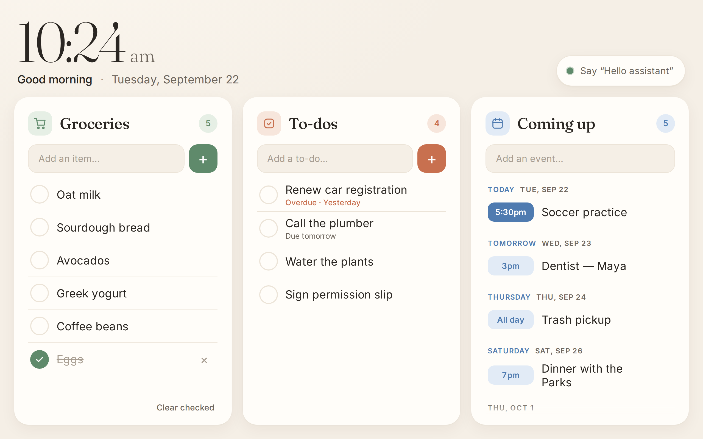
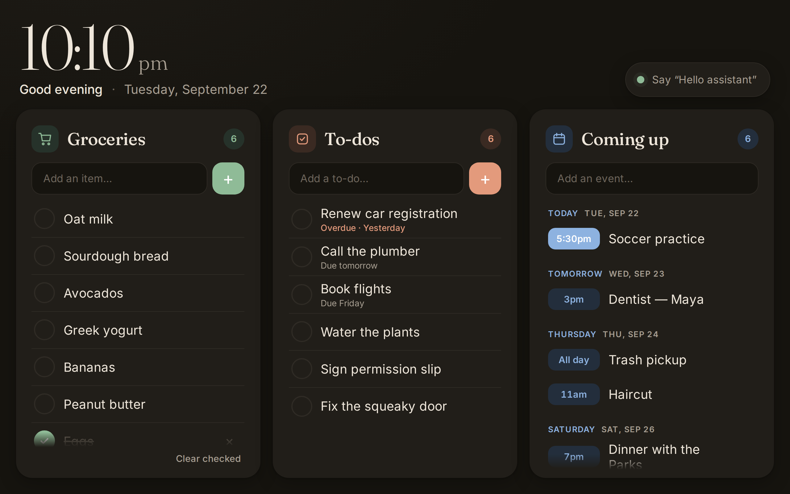
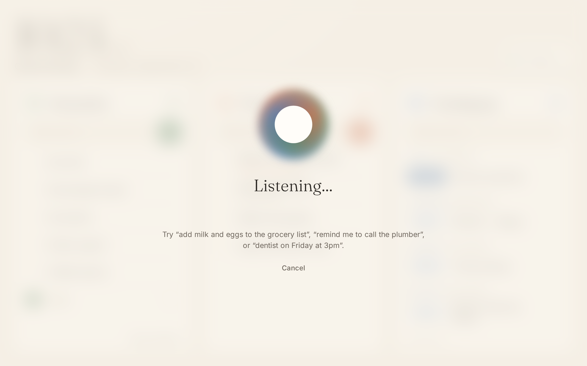

# Fridge Dashboard

An always-on family dashboard for a tablet mounted on the fridge door.

- **Groceries**: tap to check off; checked items sink to the bottom; "Clear checked" empties them.
- **To-dos**: optional due dates; overdue items turn red; finished items clear themselves after a day.
- **Coming up**: events grouped by day (Today / Tomorrow / Thursday …); past events drop off on their own.
- **"Hello assistant"** voice commands for adding to, crossing off, or reading back any list.
- Clock, greeting, optional weather, and an automatic **night mode** from 9pm to 6am.
- **Screen off without sleeping**: goes black after 10 idle minutes and wakes on a tap or "Hello assistant".
- **Live sync**: open the same address on a phone on your Wi-Fi to add things from the store or the couch.

The design borrows from Skylight, Hearth, and DAKboard: a warm, calm palette, one large clock, three big touch-friendly cards, and no clutter.

| Day | Night | Listening |
|---|---|---|
|  |  |  |

## Run it

It needs [Node.js](https://nodejs.org) 18 or newer. There are no other dependencies and nothing to `npm install`.

```bash
cd fridge-dashboard
npm start
# → http://localhost:3000
```

Data is saved to `data/db.json`. Back that file up to keep your lists.

### Options (environment variables)

| Variable | Example | What it does |
|---|---|---|
| `PORT` | `3000` | Port to listen on |
| `LAT`, `LON` | `40.71`, `-74.01` | Shows current weather via [Open-Meteo](https://open-meteo.com) (free, no key) |
| `UNITS` | `celsius` | Weather units (default: fahrenheit) |
| `CLOCK_24H` | `1` | 24-hour clock |
| `SCREEN_OFF_MINUTES` | `10` | Minutes without a tap before the screen goes black (`0` = never) |
| `DATA_DIR` | `D:\fridge` | Where to keep `db.json` |

## Setting up the tablet

**Run the server on the tablet itself.** Browsers only allow the microphone on `localhost` or HTTPS pages. If the tablet opens `http://localhost:3000`, voice works with no certificates to set up. Phones can still use `http://<tablet-ip>:3000` to view and edit the lists by touch; only the tablet does voice.

### Windows tablet (recommended)

Follow **[docs/WINDOWS-SETUP.md](docs/WINDOWS-SETUP.md)**, which goes from a freshly reset PC to a mounted fridge display. Most of it is one double-click: `setup-windows.bat` installs Node.js and Chrome, copies the dashboard to `C:\fridge-dashboard`, applies the power and quiet-Windows settings, starts it at sign-in, sets up automatic sign-in, and opens it to phones on your Wi-Fi. Running it again later updates the dashboard and keeps your lists.

### Android tablet

Run the server on another always-on machine, and use a kiosk browser such as **Fully Kiosk Browser**. Because the page won't be on `localhost`, voice will need HTTPS (for example, a Caddy reverse proxy or Tailscale HTTPS). One catch: Chrome on Android beeps every time recognition restarts, so always-on listening is more pleasant on a Windows tablet.

## Voice commands

Say **"Hello assistant"**, wait for the chime, then speak. You can also say it all in one breath, or tap the pill in the top-right corner instead of using the wake phrase.

| You say | What happens |
|---|---|
| "add milk and eggs to the grocery list" | Adds **Milk** and **Eggs** |
| "we're out of coffee" / "we need paper towels" / "add yogurt" | Groceries (the default list) |
| "remind me to call the plumber" | To-do |
| "remind me to pay rent on Friday" | To-do, due Friday |
| "add renew passport to my to-do list" | To-do |
| "dentist on Friday at 3pm" | Event |
| "schedule soccer practice tomorrow at 5:30" | Event |
| "add mom's birthday dinner to the calendar October 3rd at 7" | Event |
| "add haircut to the calendar" | Asks "what day is that?" and listens for the answer |
| "cross off eggs" / "remove milk from the grocery list" | Checks the item off |
| "what's on the grocery list?" / "what's coming up?" | Reads the list aloud |

Dates it understands: *today, tonight, tomorrow, the day after tomorrow, Friday, this/next Friday, in 3 days, in 2 weeks, the 5th, October 3rd, the 3rd of March, 12/25*. For times, a bare "at 3" means 3pm (anything from 1 to 7 is treated as afternoon or evening), or you can say *at 9 in the morning*, *noon*, *5:30 p.m.*

Speech-to-text comes from the browser (Chrome/Edge use Google's or Microsoft's cloud speech service). Command parsing happens locally in [`public/js/parser.js`](public/js/parser.js).

## Project layout

```
server.js            zero-dependency HTTP server, JSON storage, live updates (SSE)
public/index.html    layout
public/styles.css    theme (light + night), cards, voice overlay
public/js/app.js     rendering, forms, clock, weather, sync
public/js/voice.js   wake phrase loop, commands, spoken replies
public/js/parser.js  sentence → action (pure functions, unit-tested)
test/                npm test
```

## API

`GET /api/state`, `GET /api/stream` (SSE), `POST /api/{groceries|todos|events}` (one item, or `{ "items": [...] }`), `PATCH /api/{list}/{id}`, `DELETE /api/{list}/{id}`, `DELETE /api/{list}?done=1`.

## Ideas for next steps

- Pull events from Google Calendar (read-only via the calendar's secret iCal URL).
- An on-device wake word (openWakeWord / Porcupine) so the mic isn't streaming to a cloud speech service while idle.
- Let an LLM handle phrasings the rule-based parser doesn't catch.
- A photo slideshow screensaver after N minutes of no activity.
