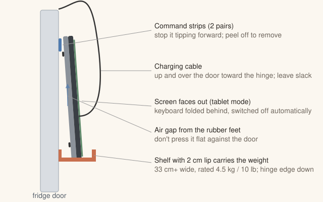

# Fridge PC setup: from a fresh Windows 11 install to a mounted dashboard

Written for a **Lenovo Yoga 920-13IKB**, but it works on any Windows 11 touchscreen PC.

**Time:** about 1 hour, most of it waiting for Windows Update.
**You'll need:** Wi-Fi, the PC's charger, and the parts in [Part 6](#part-6--mount-it-on-the-fridge) if you're mounting it today.

The end result:

- The PC never sleeps. After a power cut or a Windows Update restart it signs in and reopens the dashboard on its own.
- After 10 minutes with no one touching it, the screen goes black. It wakes as soon as someone taps it or says **"Hello assistant"**.
- Phones on your Wi-Fi can open the dashboard to add things.

---

## Part 1: Finish the Windows setup screens

Skip this part if you're already at the desktop.

1. **Region / keyboard:** your choices.
2. **Wi-Fi:** connect to your home network.
3. **Account:** a Microsoft account is fine. Two things matter later:
   - **Remember the account's password.** Automatic sign-in needs the actual password, not the PIN.
   - It's fine to set up a PIN when Windows asks.
4. **Privacy screens:** turn everything off except **Location**. Location lets the clock set its own time zone.
5. Skip the offers (Microsoft 365, OneDrive backup, Game Pass, phone link, and so on).

## Part 2: Update Windows and drivers

A fresh install is missing drivers. The touchscreen, the far-field microphones and battery control all need the right ones.

1. **Settings → Windows Update → Check for updates.** Install everything and restart. **Repeat until it says "You're up to date."** This usually takes 2–4 rounds.
2. **Settings → Windows Update → Advanced options → Optional updates → Driver updates:** tick everything, install, and restart.
3. **Microsoft Store → Library (bottom left) → Get updates.** Wait until everything finishes. This also gets `winget` working, which the setup script uses to install apps.
4. **Settings → Time & language → Date & time:** turn on **Set time zone automatically** and **Set time automatically**.
5. **Check the touchscreen and microphone:**
   - Tap around the screen. Touch should work everywhere.
   - **Settings → System → Sound → Input → Microphone Array → Start test.** Talk from across the room. The bar should move.

## Part 3: Download the dashboard and run setup

1. In Edge, open this link. The download starts right away:
   **<https://github.com/syeluru/hello-world/archive/refs/heads/claude/fridge-dashboard-voice-iusakf.zip>**
2. Open **Downloads**, right-click the zip → **Extract All… → Extract**.
3. In the extracted folder, open **`fridge-dashboard`** and double-click **`setup-windows.bat`**.
   - If you see **"Windows protected your PC"**, click **More info → Run anyway**. This appears because the file came from the internet.
   - When Windows asks **"Do you want to allow this app to make changes?"**, click **Yes**.
4. A blue window works through each step. It will ask you four things:

   | It asks | What to do |
   |---|---|
   | **Town or ZIP code for the weather** | Type it, e.g. `78704` or `Austin`, or press Enter to skip |
   | **Sign in automatically after restarts?** | Press Enter (yes). An **Autologon** window opens: **Username** = your Microsoft account **email** · **Domain** = leave it · **Password** = the account **password**, not the PIN. Click **Enable**, then **OK**. |
   | **Allow phones on this home Wi-Fi to open the dashboard?** | Press Enter (yes) |
   | **Restart now?** | Say **no (n)** for now and finish Part 4 first |

   At the end it shows the address to open on a phone, e.g. `http://192.168.1.23:3000`. Write it down.

What the script changes (all of it can be undone in Settings)

1. Installs **Node.js**, **Google Chrome** and **Lenovo Vantage** (skipping any already installed).
2. Copies the dashboard to **`C:\fridge-dashboard`**.
3. Saves your weather location in `C:\fridge-dashboard\settings.cmd`.
4. **Power (when plugged in):** the screen never turns off, the PC never sleeps or hibernates, closing the lid does nothing, and there's no password prompt when it wakes. See [why the screen never turns off](#why-windows-never-turns-the-screen-off).
5. **Quiet Windows:** notification pop-ups, "tips / welcome / finish setting up" screens, the screen saver and edge swipes are turned off. The microphone is allowed for desktop apps. Windows Update active hours are set to 6am–11pm.
6. Adds a **"Fridge Dashboard"** shortcut to your Startup folder.
7. **Automatic sign-in** with Microsoft's Sysinternals Autologon. It also turns off "only allow Windows Hello sign-in", which blocks automatic sign-in.
8. Marks your home Wi-Fi as a **Private** network and lets phones on it reach the dashboard. Public networks stay blocked.

## Part 4: Settings the script can't change

1. **Battery (important for a laptop that's always plugged in):** open **Lenovo Vantage → Device → Power → Battery settings** and turn on **Conservation Mode**. This caps the charge at about 60%, so the battery doesn't wear out or swell from sitting at 100%.
2. **Touch gestures:** **Settings → Bluetooth & devices → Touch** → turn off **Three- and four-finger touch gestures**.
3. **Brightness:** **Settings → System → Display** → turn off **Change brightness based on content**, and set a comfortable level (about 60–70%).
4. **Active hours:** **Settings → Windows Update → Advanced options → Active hours** should read *Manually, 6:00 AM – 11:00 PM*. If it's set to "Automatically", switch it to Manually.
5. **Microphone check:** **Settings → Privacy & security → Microphone**: *Microphone access* and *Let desktop apps access your microphone* should both be **on**.

## Part 5: Test it (before mounting)

1. **Restart** the PC. Don't touch anything. It should sign in by itself, and within about 30 seconds the dashboard should open full-screen.
2. Say **"Hello assistant, add milk to the grocery list."** You'll hear a chime, then Milk appears.
3. Open the address from Part 3 on your phone and add something. It should show up on the laptop instantly.
4. Leave the laptop alone for **10 minutes**. The screen should go black. Tap it, and the dashboard should come right back.
5. **Fold it into tablet mode** (screen all the way round). The keyboard switches off automatically, and the dashboard should stay up and fill the screen.
6. Leave it running overnight, then check it's still going in the morning.

> **To get out of the full-screen dashboard:** fold the laptop back into laptop mode and press **Alt+F4**. To start it again, restart, or double-click `C:\fridge-dashboard\start-kiosk.bat`.

---

## Part 6: Mount it on the fridge

In tablet mode the Yoga 920 is a **13.9″ screen**. It's about **32 × 22 cm, 1.5 cm thick, and 1.4 kg (3 lb)**. That's heavier than a tablet, so let a shelf carry the weight rather than magnets or tape alone.

### First: check whether your fridge is magnetic

Stick an ordinary fridge magnet on the door. Many **stainless steel doors aren't magnetic**, even though the sides of the fridge usually are.

### Recommended: a shelf that holds the weight, plus a strip at the top

**What to buy:**

| Part | What to look for | About |
|---|---|---|
| **Shelf** | A **magnetic fridge shelf** (sold as a "magnetic spice rack") **at least 33 cm (13″) wide**, with a **front lip at least 2 cm tall**, **rated for 4.5 kg (10 lb)** or more. If the door isn't magnetic, get an **adhesive** shelf or caddy with the same size and rating. | $15–25 |
| **Top hold** | **Command Picture Hanging Strips, Large** (the interlocking kind that snap together) | $8 |
| **Charging cable** | A **2–3 m (6–10 ft) USB-C to USB-C** cable, rated **60 W or 100 W**, ideally with a **right-angle** plug | $12 |
| **Cable clips** | Small adhesive cable clips, or 3M Command cord clips | $5 |
| **Bumpers (optional)** | A few clear 5 mm adhesive rubber bumpers | $5 |

**Steps:**

1. **Pick the spot.**
   - Put it on the **hinge side** of the door, where it swings the least and the cable moves least.
   - The **middle of the screen at eye height** works well, about 150 cm (5 ft) from the floor.
   - Keep it away from the water/ice dispenser.
2. **Put the shelf on the door** at the height where the bottom edge of the laptop will sit.
3. **Fold the Yoga into tablet mode** with the **hinge at the bottom**. The screen faces out, and the laptop's underside (with its rubber feet) faces the fridge.
4. **Stand it in the shelf,** leaning back slightly against the door. The rubber feet leave a small air gap behind it. **Don't press it flat against the door**, because air needs to reach the bottom vents. Add bumpers to the top corners if it sits too flat.
5. **Top strips:** stick 2 pairs of Command strips to the **top corners of the back** and press the laptop onto the door for 30 seconds. They stop it tipping forward when the door swings. To take the laptop down, peel it off the strips; the strips separate and can be snapped back.
6. **Keep the side edges clear.** The power button, volume buttons and USB-C ports are on the sides, and the shelf and strips shouldn't press them.
7. **Charging cable:**
   - Plug in on the side nearer the hinge.
   - Run the cable up and over the top of the door toward the hinge, then down the side of the fridge to the outlet. Hold it with cable clips.
   - **Leave a loose loop at the hinge**, then open the door all the way to make sure nothing pulls or gets pinched.
   - Use the Lenovo charger, or any USB-C charger rated **45 W or more**.
8. **Rotation lock:** once it's mounted and the picture is the right way up, swipe open Quick Settings (bottom-right corner) and turn on **Rotation lock**. Otherwise a door slam can flip the screen.

### Don'ts

- **Don't stick strong magnets onto the laptop itself.** The Yoga uses magnet sensors to detect the lid closing and tablet mode, so a magnet in the wrong place can make it think the lid is shut. The setup script makes lid closing do nothing, which helps, but a shelf avoids the problem entirely.
- **Don't let tape or strips carry the whole 1.4 kg** on a door that gets slammed. Let the shelf take the weight.
- **Don't block the air gap** behind it or cover the hinge edge.
- **Don't cover the small microphone holes** on the screen bezel. The far-field microphones are what make "Hello assistant" work from across the kitchen.

### No-shelf alternative

If you'd rather not use a shelf, fold it into **tent mode** (an upside-down V) and stand it **on top of the fridge** or on the counter, facing the room. This needs no mounting at all. The screen sits higher, but it's still easy to see and hear.

---

## Everyday use

- **Phones:** bookmark the address from Part 3 (e.g. `http://192.168.1.23:3000`), or tap **Share → Add to Home Screen** to get an app icon. Voice works on the fridge only; phones use touch.
- **Weather location / screen timeout:** edit `C:\fridge-dashboard\settings.cmd` (open it with Notepad), then restart.
- **Updating the dashboard:** download the zip again (Part 3), extract it, and double-click `setup-windows.bat`. Your lists and settings are kept, and anything already done is skipped.
- **Backup:** your lists live in `C:\fridge-dashboard\data\db.json`.

## Why Windows never turns the screen off

On most Windows 11 touchscreen PCs, when Windows turns the display off, the whole PC drops into a low-power standby. In that state a tap often won't wake it and the microphone stops listening. So Windows keeps the display on, and the dashboard blacks out the screen itself while the PC stays fully awake. A tap or "Hello assistant" brings it back instantly, and the waking tap won't press anything underneath it.

To change the 10 minutes, edit `SCREEN_OFF_MINUTES` in `settings.cmd`. Set it to `0` to keep the dashboard on all the time. A black screen still has a faint glow because the backlight stays on, which uses a few watts.

## Troubleshooting

| Problem | Fix |
|---|---|
| Setup says **"winget is not ready yet"** | Microsoft Store → Library → Get updates, wait for it to finish, then run `setup-windows.bat` again. |
| **"Windows protected your PC"** | Click **More info → Run anyway**. |
| After a restart it **stops at the lock screen** | Run `setup-windows.bat` again and redo Autologon. Use the account **email** and **password**, not the PIN. Windows Update sometimes clears this. |
| The dashboard **didn't open** after sign-in | Double-click `C:\fridge-dashboard\start-kiosk.bat`. If a window says `'node' is not recognized`, restart once. Otherwise run setup again. |
| The pill says **"Tap to allow the microphone"** | Check Part 4, step 5, then tap the pill. |
| **Voice doesn't hear you** from across the room | Settings → System → Sound → Input → Microphone Array → set **Input volume** to about 80–100. Check Windows Update → Optional updates for an audio driver. |
| **Voice stops** after a while | Usually a Wi-Fi drop, since Chrome's speech recognition runs in the cloud. It retries on its own; tapping the pill restarts it right away. |
| The screen goes dark and **only the power button** wakes it | Windows switched the display off. Run setup again (it sets the screen timeout back to Never). |
| The **phone can't open** the address | The phone must be on the same Wi-Fi. Run setup again and answer **yes** to the phones question. Also check that the laptop's address hasn't changed; setup shows the current one at the end. |
| The **screen flips upside down** | Turn on Rotation lock (Part 6, step 8). |
